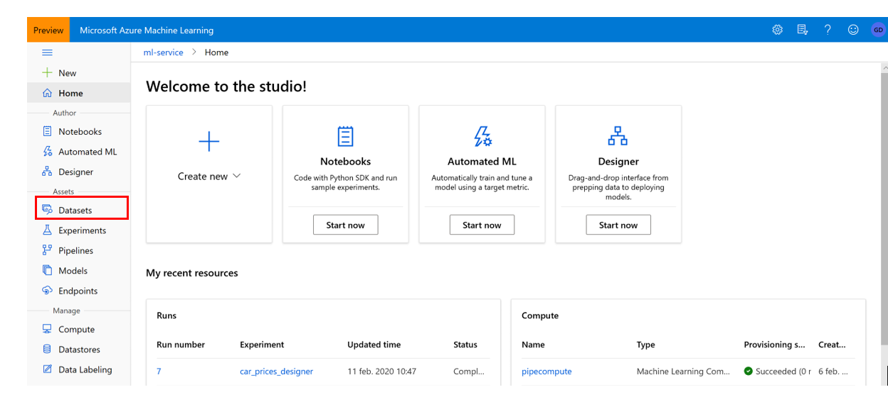
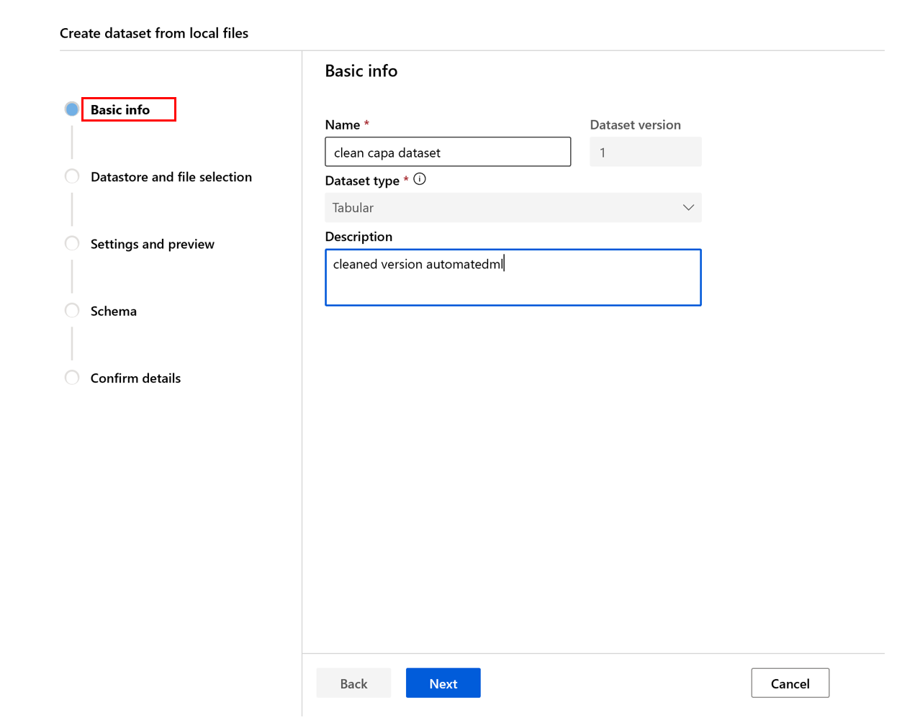
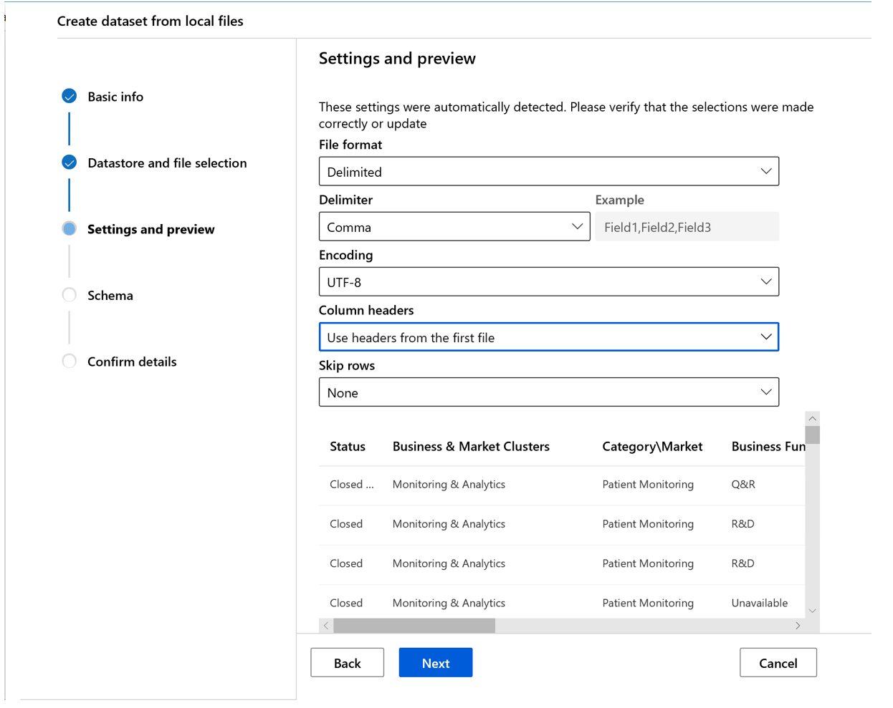
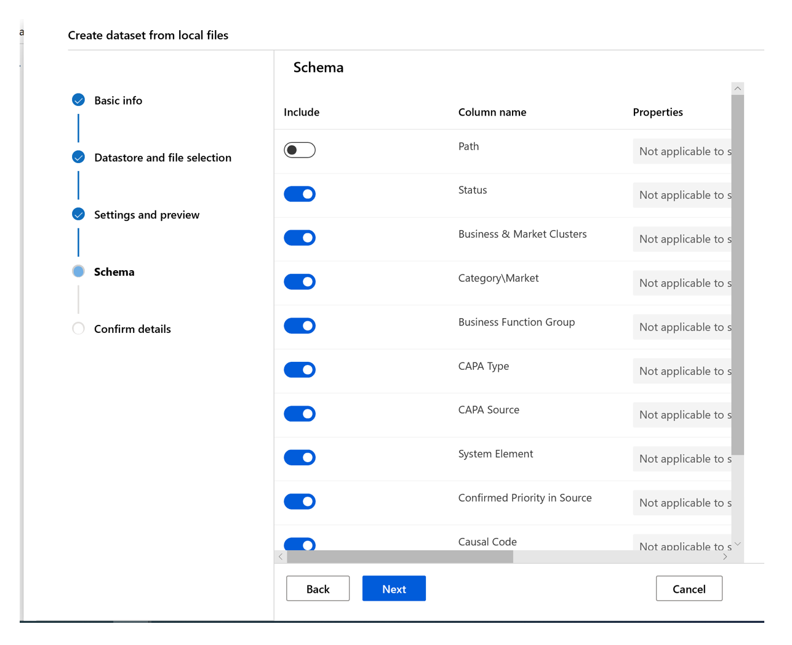
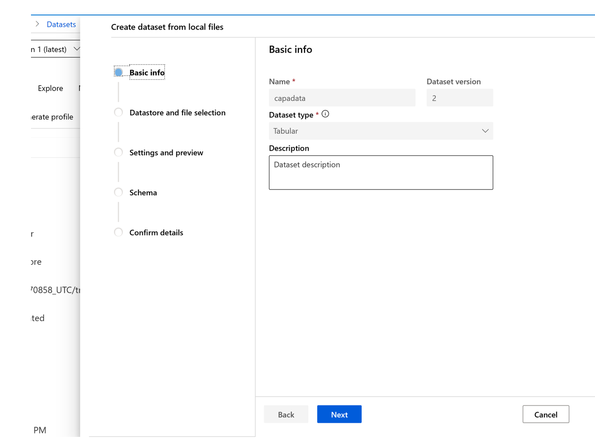

# Datasets & versioning in AML

Dataset versioning is a way to bookmark the state of your data so that you can apply a specific version of the dataset for future experiments.

This tutorial consists of two separate steps where the first one is necessary to start an automated ML run based on the first version of the dataset. The second part of the tutorial  focuses on creating a second version of the dataset. 

**When do you version a dataset?**

•	When new data is available for retraining

•	When you're applying different data preparation or feature engineering approaches

## Register and retrieve dataset versions

By registering a dataset, you can version, reuse, and share it across experiments and with colleagues. You can register multiple datasets under the same name and retrieve a specific version by name and version number.

**Good to know:**

•	When you create a dataset version, you're not creating an extra copy of data with the workspace. Because datasets are references to the data in your storage service, you have a single source of truth, managed by your storage service.

•	When you load data from a dataset, the current data content referenced by the dataset is always loaded. If you want to make sure that each dataset version is reproducible, we recommend that you not modify data content referenced by the dataset version. When new data comes in, save new data files into a separate data folder and then create a new dataset version to include data from that new folder.

•	You can use a dataset as the input and output of each Machine Learning pipeline step. When you rerun pipelines, the output of each pipeline step is registered as a new dataset version. Because Machine Learning pipelines populate the output of each step into a new folder every time the pipeline reruns, the versioned output datasets are reproducible.

In the first part of this tutorial you are going to register a dataset which will automatically be versioned as version 1. In the second part of the tutorial it is explained how to create a second version (version 2) of the original dataset (version 1).

Step 1: Get the dataset from the blob storage and import it into AML. Go to **Datasets**.

Step 2: Click create **dataset**

Step 3: Fill in the basic information. Note that the data is versioned (version 1). Click **next**

Step 4: Fill in the datastore and file selection, click previously created datastore and click **next**

Step 5: Enter the settings as stated below in the settings in preview click **next**

Step 6: leave the settings as they are and click **next**

Step 7: in **Confirm details** click **Profile this dataset after creation**

Step 8: when successful it shows: *Success: clean capa dataset dataset created successfully.*

## Creating a second version of the dataset

Step 1: Go to **datasets**, click on the **dataset** you have a new version for:

Step 2: click on **new version** and choose from which location you want to pick up the new version:

Step 3: Fill in the necessary information (e.g. what type of change happened in the description) walk through the same steps as in part 1 (datastore and file section, setting and preview, schema, confirm details). Notice that in basic information it automatically states which version this is of the dataset.

Step 4: when the new dataset is uploaded, two versions of the capadataset can be found.

This is the end of part 1 of the workshop focused on loading datasets into AML and how to version those datasets. The notebook version can be found in the same folder (0.0_dataset.ipynb).
