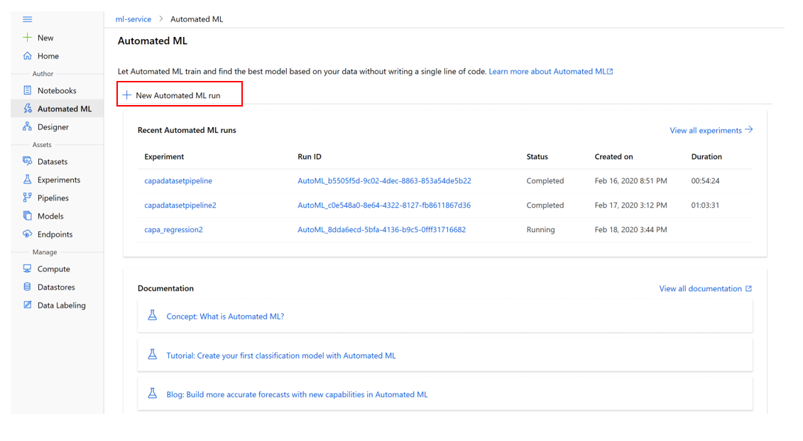

# Create automated ML run
Step 1: click Automated ML on the left panel, in the Automated ML page click **New Automated ML run**

Step 2: Select the dataset just imported in the previous steps. Notice that the dataset can be reviewed by clicking on the datasets.

 
Step 3: Configure the run as indicated below

 
Step 4: Select the task type, there are three options: classification, regression & time series forecasting.

 
Step 5: to change additional setting click on View additional configuration settings:

Background information on additional configurations
•	**Primary metric**: Evaluation metric that the machine learning algorithm will be measured by.
•	**Automatic featurization**: Enables preprocessing. This includes automatic data cleansing, preparing, and transformation to generate synthetic features.
•	**Blocked algorithms**: Algorithms you want to exclude from the training job
•	**Exit criterion**: If a criteria is met, the training job is stopped.
•	**Validation**: Choose a cross-validation type and number of tests.
•	**Concurrency**: The maximum number of parallel iterations executed per iteration
Step 6: Select **Finish** to run the experiment. The **Run Detail** screen opens with the **Run status** at the top as the experiment preparation begins.

Good to know: Preparation takes **10-15 minutes** to prepare the experiment run. Once running, it takes **2-3 minutes more for each iteration.**
Select **Refresh** periodically to see the status of the run as the experiment progresses.
In production, you'd likely walk away for a bit. But for this tutorial, we suggest you start exploring the tested algorithms on the **Models** tab as they complete while the others are still running.

